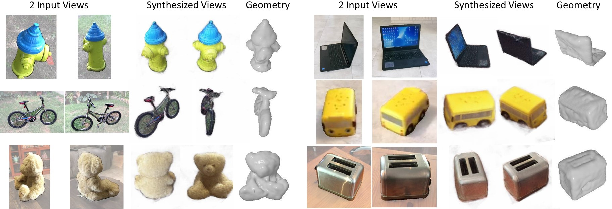

# SparseFusion

[**SparseFusion: Distilling View-conditioned Diffusion for 3D Reconstruction**](https://sparsefusion.github.io/)<br/>
[Zhizhuo Zhou](https://www.zhiz.dev/),
[Shubham Tulsiani](https://shubhtuls.github.io/)<br/>
_CVPR '23 | [GitHub](https://github.com/zhizdev/sparsefusion) | [arXiv](https://arxiv.org/abs/2212.00792) | [Project page](https://sparsefusion.github.io/)_


SparseFusion reconstructs a consistent and realistic 3D neural scene representation from as few as 2 input images with known relative pose. SparseFusion is able to generate detailed and plausible structures in uncertain or unobserved regions (such as front of the hydrant, teddybear's face, back of the laptop, or left side of the toybus).

---
## Shoutouts and Credits
This project is built on top of open-source code. We thank the open-source research community and credit our use of parts of [Stable Diffusion](https://github.com/CompVis/stable-diffusion), [Imagen Pytorch](https://github.com/lucidrains/imagen-pytorch), and [torch-ngp](https://github.com/ashawkey/torch-ngp) [below](#acknowledgements). 


## Code (early access)
We are releasing our inference code in early access. Future releases may drastically overwrite early access code. Our early access release will contain:

1. Code for inference
2. Pretrained weights for 10 categories

The repository is still under construction and I am working on improving comments and code readability.
For bugs and issues, please open an issue on GitHub and I will try to address it promptly.

---
## Environment Setup
Please follow the environment setup guide in [ENVIRONMENT.md](ENVIRONMENT.md).

## Dataset
We provide two options for datasets, the original CO3Dv2 dataset and also a heavily cutdown toy dataset for demonstration purposes only. Please download at least one dataset. 

1. (optional) Download CO3Dv2 dataset (5.5TB) [here](https://github.com/facebookresearch/co3d) and follow instructions to extract them to a folder. We assume the default location to be `data/co3d/{category_name}`.
2. Download the toy evaluation only CO3Dv2 dataset (6.7GB) [here](https://drive.google.com/drive/folders/1IzgFjdgm_RjCHe2WOkIQa4BRdgKuSglL?usp=share_link) and place them in a folder. We assume the default location to be `data/co3d_toy/{category_name}`. 

## Pretrained Weights
SparseFusion requires both SparseFusion weights and Stable Diffusion VAE weights. 
1. Find SparseFusion weights [here](https://drive.google.com/drive/folders/1Czsnf-PVjwH-HL7K5mTt_kF9u-PVWRyL?usp=share_link). Please download and put in `checkpoints/sf/{category_name}`. 
2. Download Stable Diffusion v-1-3 weights [here](https://huggingface.co/CompVis/stable-diffusion-v-1-3-original) and rename `sd-v1-3.ckpt` to `sd-v1-3-vae.ckpt`. While our code is compatible with the default downloaded weight, we only use the VAE weights from Stable Diffusion. We assume the default location and filename of the vae checkpoint to be `checkpoints/sd/sd-v1-3-vae.ckpt`. 

## Evaluation


### Examples
To run evaluation, assuming the CO3D toy dataset and model weights are in the default paths specified above, simply pass in `-d, --dataset_name` and `-c, --category`:
```shell
$ python demo.py -d co3d_toy -c hydrant
```

To specify specific scenes on evaluate on, pass the desired index `0,5,7` to `-i, --idx`. 
```shell
$ python demo.py -d co3d_toy -c hydrant -i 0,5,7
```

To specify the number of input views to use, specify `-v, --input_views`.
```shell
$ python demo.py -d co3d_toy -c hydrant -i 0,5,7 -v 3
```

To specify a custom dataset root location, specify `-r, --root`.
```shell
$ python demo.py -d co3d_toy -r data/co3d_toy -c hydrant -i 0,5,7 -v 3
```

To specify custom model checkpoints, specify `--eft`, `--vldm`, and `--vae`. 
```shell
$ python demo.py -d co3d_toy -r data/co3d_toy -c hydrant -i 0,5,7 -v 3 \
--eft checkpoints/sf/hydrant/ckpt_latest_eft.pt \
--vldm checkpoints/sf/hydrant/ckpt_latest.pt \
--vae checkpoints/sd/sd-v1-3-vae.pt
```

To use the original CO3Dv2 dataset, pass `co3d` for dataset_name `-d` and also the dataset root location `-r`.
```shell
$ python demo.py -d co3d -r data/co3d/ -c hydrant -i 0
```

### Flags
```
-g, --gpus              number of gpus to use (default: 1)
-p, --port              last digit of DDP port (default: 1)
-d, --dataset_name      name of dataset (default: co3d_toy)
-r, --root              root directory of the dataset 
-c, --category          CO3D category
-v, --input_views       number of random input views (default: 2)
-i, --idx               scene indices to evaluate (default: 0)
-e, --eft               location to EFT checkpoint
-l, --vldm              location to VLDM checkpoint
-a, --vae               location to Stable Diffusion VAE checkpoint
```

### Output
Output artifacts—images, gifs, torch-ngp checkpoints—will be saved to `output/demo/` by default. 

---

## Training
Early access training code is provided in `train.py`. Please follow the evaluation tutorial above to setup the environment and pretrained VAE weights. It is recommended to directly modify `train.py` to specify the experiment directory and set the training hyperparameters. We show training flags below. 

### Flags
```
-g, --gpus              number of gpus to use (default: 1)
-p, --port              last digit of DDP port (default: 1)
-d, --dataset_name      name of dataset (default: co3d_toy)
-r, --root              root directory of the dataset 
-c, --category          CO3D category
-a, --vae               location to Stable Diffusion VAE checkpoint
-b, --backend           distributed data parallel backend (default: nccl)
```

---
## Citation
If you find this work useful, a citation will be appreciated via:

```
@inproceedings{zhou2023sparsefusion,
  title={SparseFusion: Distilling View-conditioned Diffusion for 3D Reconstruction}, 
  author={Zhizhuo Zhou and Shubham Tulsiani},
  booktitle={CVPR},
  year={2023}
}
```

## Acknowledgements 
We thank Naveen Venkat, Mayank Agarwal, Jeff Tan, Paritosh Mittal, Yen-Chi Cheng, and Nikolaos Gkanatsios for helpful discussions and feedback. We also thank David Novotny and Jonáš Kulhánek for sharing outputs of their work and helpful correspondence. This material is based upon work supported by the National Science Foundation Graduate Research Fellowship under Grant No. (DGE1745016, DGE2140739).

We also use parts of existing projects: 

VAE from [Stable Diffusion](https://github.com/CompVis/stable-diffusion).
```
@misc{rombach2021highresolution,
      title={High-Resolution Image Synthesis with Latent Diffusion Models}, 
      author={Robin Rombach and Andreas Blattmann and Dominik Lorenz and Patrick Esser and Björn Ommer},
      year={2021},
      eprint={2112.10752},
      archivePrefix={arXiv},
      primaryClass={cs.CV}
}
```

Diffusion model from [Imagen Pytorch](https://github.com/lucidrains/imagen-pytorch).
```
@misc{imagen-pytorch,
    Author = {Phil Wang},
    Year = {2022},
    Note = {https://github.com/lucidrains/imagen-pytorch},
    Title = {Imagen - Pytorch}
}
```

Instant NGP implementation from [torch-ngp](https://github.com/ashawkey/torch-ngp).
```
@misc{torch-ngp,
    Author = {Jiaxiang Tang},
    Year = {2022},
    Note = {https://github.com/ashawkey/torch-ngp},
    Title = {Torch-ngp: a PyTorch implementation of instant-ngp}
}
```